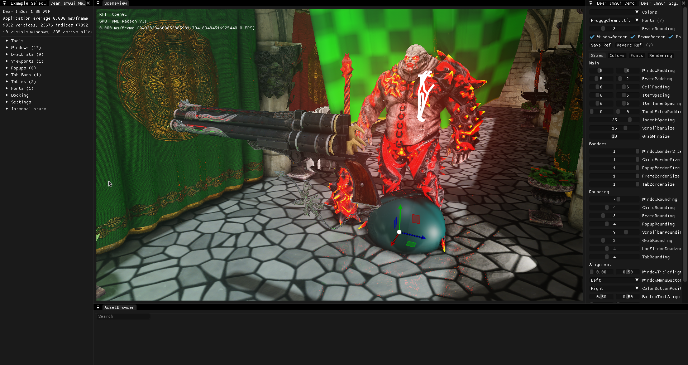

# RacoonEngine

RacoonEngine is a cross-platform 3D engine and application framework for any kind of 3D applications like games, interactive simulations or visualizations. It's based on a highly flexible scene graph system that allows you to compose and visualize any type of 3D scene for your application.

RacoonEngine is written in C++ and has been designed with flexibility and extensibility as one of it's main goals. Therefore, it's not only a 3D engine, but a consistent framework that allows you to combine all the components that you need for your application without having to care about the differences of the actual libraries, APIs or operating systems that you are using. The underlying systems and libraries are abstracted by a powerful reflection and component system, which makes it easier and more effective to create applications for different platforms and target components such as rendering, sound, physics, network, scripting and so on.

## Status

## Notes

Please keep in mind that this is a highly prototypical piece of work, structures, classes, file formats can and will change without prior warning.
The screenshot taken for the editor view is also considered highly prototypically as it was just a proof of concept implementation and will change as the next target for this project is to add the editing tools.

## Screenshots

"Game"-Mode view:

"Editor"-Mode view:

## Getting Started

Follow the instructions below to compile and run the engine from source.

### Linux

